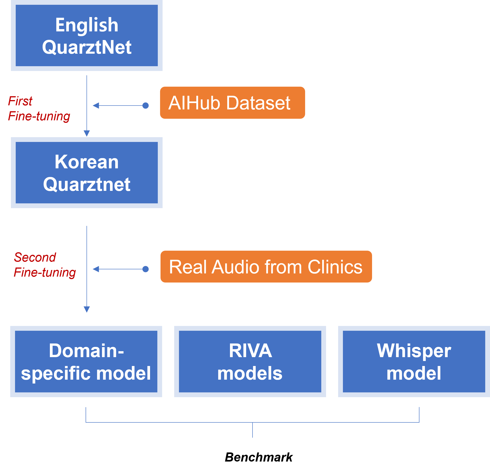

# Autonomic Speech Recognition of Domain-Specific (Radiation Oncology Clinics) Korean Language 
This GitHub repository contains Jupyter notebooks presenting the research results of an ongoing submission.

(Title: Development and Benchmarking of a Korean Audio Speech Recognition Model for Clinician-Patient Conversations in Radiation Oncology Clinics)

---------------------------------------------------------

Purpose: The purpose of this study is to develop an audio speech recognition (ASR) deep learning model for transcribing clinician-patient conversations in radiation oncology clinics.

Methods: The pre-trained English QuartzNet 15x5 model was fine-tuned for the Korean language using a publicly available dataset comprising recordings and transcriptions of simulated situations between clinicians and patients. Real conversations between a radiation oncologist and 115 patients in actual clinics were then prospectively collected, transcribed, and divided into training (30.26 hours) and testing (0.79 hours) sets. These datasets were used to develop the ASR model for clinics and benchmark it against other ASR models, including the 'Whisper large,' the 'RIVA Citrinet-1024 Korean model,' and the 'RIVA Conformer Korean model.'

Results: The pre-trained English ASR model was successfully fine-tuned and converted to recognize the Korean language, resulting in a character error rate (CER) of 0.17. However, we found that this performance was not maintained on the real conversation dataset. We then further fine-tuned the model, resulting in an improved CER of 0.26. When benchmarked against other ASR models, the developed model showed a CER of 0.31, 0.28, and 0.25, respectively, for the 'Whisper large,' the 'RIVA Citrinet-1024 Korean model,' and the 'RIVA Conformer Korean model.' On the general Korean conversation dataset, 'zeroth-korean,' our model showed a CER of 0.44, while the 'Whisper large,' the 'RIVA Citrinet-1024 Korean model,' and the 'RIVA Conformer Korean model' resulted in CERs of 0.26, 0.98, and 0.99, respectively.

Conclusion: In conclusion, we developed a Korean ASR model to transcribe real conversations between a radiation oncologist and patients. The performance of the model was deemed acceptable for both specific and general purposes, compared to other models. We anticipate that this model will reduce the time required for clinicians to document the patient's chief complaints or side effects.

---------------------------------------------------------
The models will be made available through a separate link at a later time.

